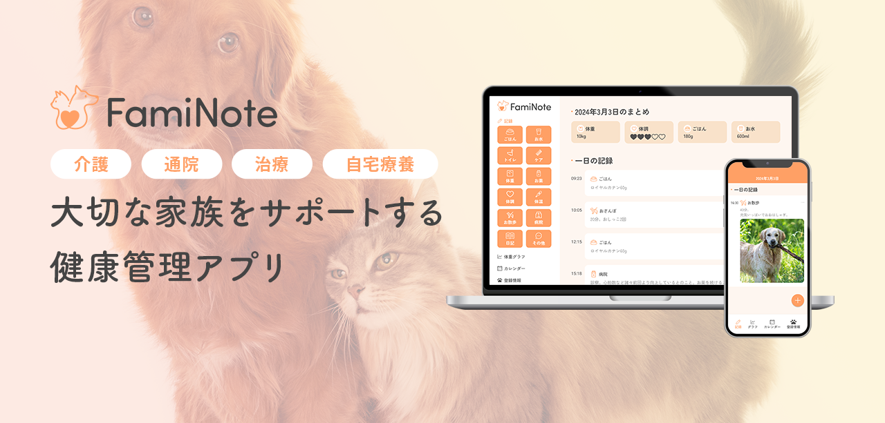

# アプリURL
https://faminote-app.web.app/

# 概要
FamiNote（ファミノート）は大切な家族であるペットの健康管理アプリです。  
日々の記録を付けることで、  
- 介護  
- 通院  
- 治療  
- 自宅療養

など、ケアが必要な家族の生活をサポート出来ます。

# 使用技術
**▼フロントエンド**
- HTML
- CSS/Sass
- JavaScript
- React 18.2.0
- TypeScript 5.2.2

**▼インフラ**
- Firebase 10.8.1

**▼その他**
- Figma
- Adobe Photoshop
- Adobe Illustrator

# 機能一覧
