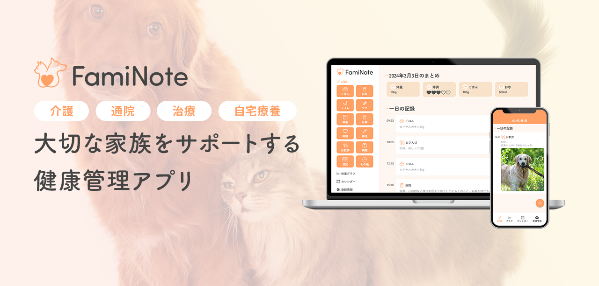

# アプリURL
https://faminote-app.web.app/

# 概要
FamiNote（ファミノート）は大切な家族であるペットの健康管理アプリです。  
日々の記録を付けることで、  
- 介護  
- 通院  
- 治療  
- 自宅療養

など、ケアが必要な家族の生活をサポート出来ます。

# 使用技術
**▼フロントエンド**
- HTML
- CSS/Sass
- JavaScript
- React 18.2.0
- TypeScript 5.2.2

**▼インフラ**
- Firebase 10.8.1

**▼その他**
- Figma
- Adobe Photoshop
- Adobe Illustrator

# 機能一覧
### 日々の記録
- ごはん、お水、トイレなど、お世話内容を記録することができます。

- 記録した内容は、タイムラインにその日一日の出来事として記録されます。（画像の添付も可能です。）

- 一日のまとめを記録することができます。
  - 体重（上書きして更新することが可能です。）
  - 一日を通しての体調（上書きして更新することが可能です。）
  - 一日の総食事量（自動計算されます。）
  - 一日の総水分摂取量（自動計算されます。）

### 体重の推移グラフ
- 一か月ごと、あるいは一週間ごとの体重の推移をグラフで確認できます。
- ※現在、グラフは自動生成されたランダムな値に基づいて描画されています。

### カレンダー
- あああ

### 登録情報の記録
- あああ

### その他
- レスポンシブ対応

### 今後実装したいもの
- 記録ページ内の編集機能
- 記録ページで記録した体重を体重グラフページに連携
